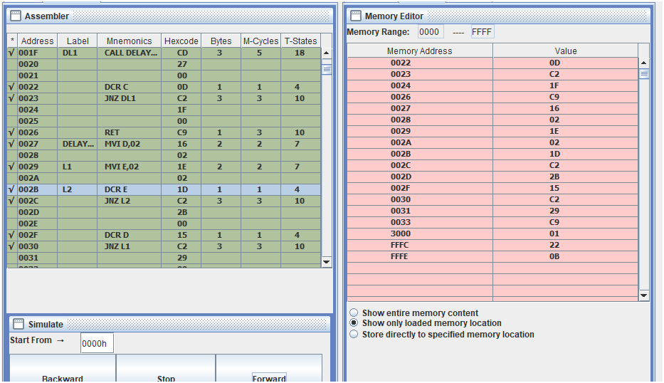
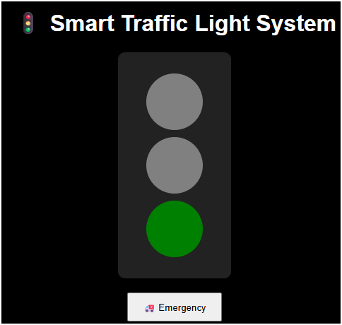

# 🚦 Traffic Light System using 8085 Microprocessor

## 🔥 Features
- Real-time traffic signal simulation
- Sequential control (Green → Yellow → Red)
- Continuous loop execution

## 🧠 Concept
This project simulates a traffic light system using 8085 microprocessor.  
The output is stored at memory location 3000H.

## ⚙️ Working
- 01H → Green  
- 02H → Yellow  
- 04H → Red  

## 📸 Output

## 📊 Diagram

## 💻 Code
[View Code](traffic_8085.asm)

## 👩‍💻 Author
Gulshan kumar